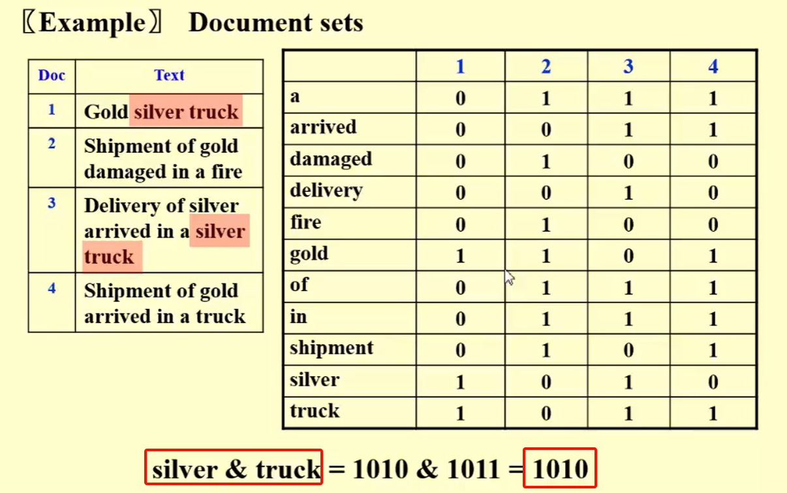
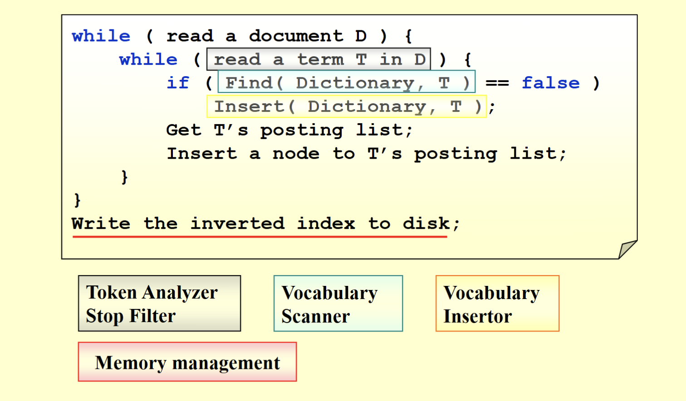
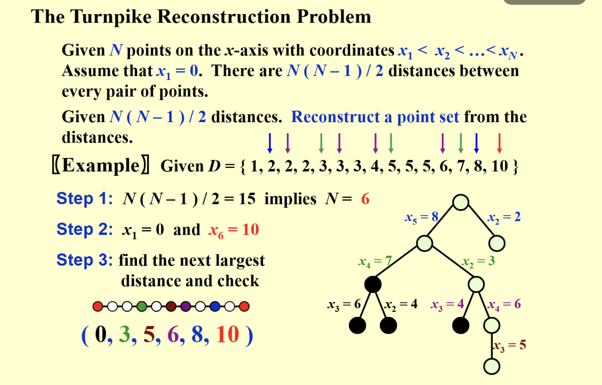
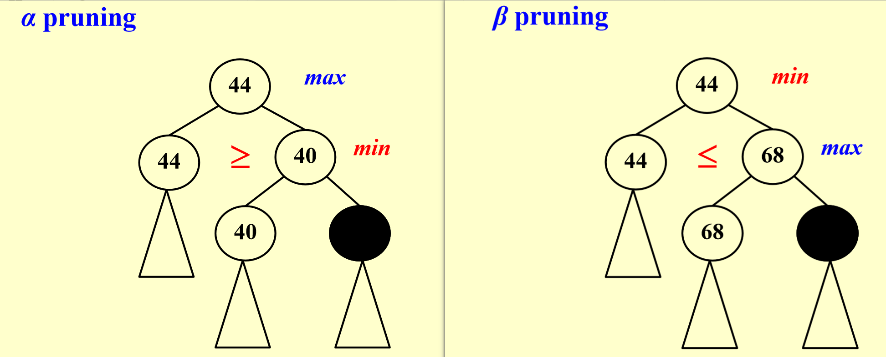
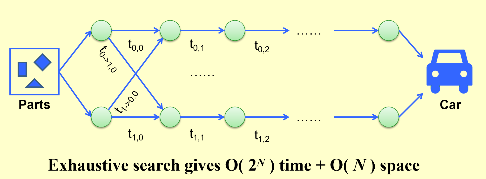
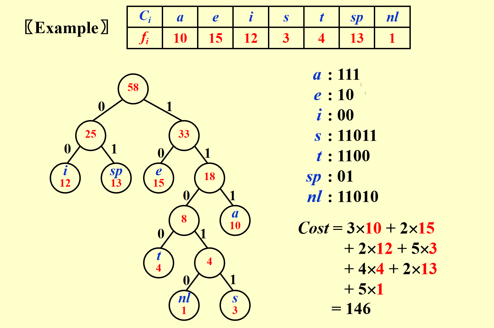

# Tips
## 回顾
- 二项队列的删除；
- 分治--主方法

<hr>


# 整理
## Inverted File Index
### Concepts
- 为什么我们需要倒排索引？
1. 搜索引擎对于给出的`term`，需要返回包含该`term`的`document`；
2. 通常的`index`指的是`doc`当中具体`term`的出现位置。但是我们无法直接搜索整篇`doc`，因为这样的操作时间成本太高；
3. 因此，我们给每一个`term`设置倒排索引，用来记录它们各自在整体`doc`中的分布情况.

#### Term-Document Incidence Matrix

> 1. 提取所有`doc`当中出现的所有`term`；
> 2. 建立如图所示的矩形，用`1/0`表示该`term`是否在某个`doc`当中出现，形成各自的二进制向量；
> 3. 如果要同时找出包含`A`,`B`两个`term`的`doc`索引，只需要将二者的向量作`&`运算；

<br>

- `TDIM`的方式有什么不足？
  - 可能出现较多的`0`,导致空间和时间的浪费；
  - 无法指示`term`在对应`doc`当中的出现的频率以及具体的位置；

#### Compact Version: Inverted File Index

根据前一个方法的不足，我们改进得到这样的倒排索引：  
在现在的版本，我们在`Posting List`当中记录了每个`term`的:
1. 总共出现的次数`time`（用于根据出现频率排序），如果要寻找多个`term`同时出现的`doc`，我们应该从`time`较小的`term`开始搜索，顺序检查其`Posting List`当中的`doc`是否被其他`term`所共有，这样就可以减少不必要的搜索；
2. 分别出现的位置`Documents Words`: (`docID`, `wordPos`)
   >`wordPos`应当为一个数组，因为一个`term`可能在同一个`doc`当中出现多次；

相关的概念:
> 1. `Term Dictionary`: 记录所有出现的`term`；
> 2. `Posting List`: 记录各个`term`的`times`以及`Document Words`.  
> 

<hr>

#### Index Generator

**Steps:**
1. 读取所有的文档；
2. 然后调用`Stop Filtter`对文档进行预处理，去除停用词；
3. 对于选中的`term`，调用`vocabulary scanner`扫描文档；
   >如果在`Term Dictionary`中不存在该`term`，则添加到`Term Dictionary`中；
4. 找到`term`及其`Posting List`，向其中插入新的`node`；
5. 结束之后，将倒排索引写回`disk`.
> 接下来，我们将从上述不同方面展开介绍如何设计一个`serach engine`.

<hr>

##### Read in
- `Stemming`: 将单词变为它的词干，如`running`变为`run`;
- `Stop Filtter`: 过滤掉一些无意义的词，如`the`, `and`, `a`, `an`等;

<br>

##### Access Term
- solution 1: `Search tree`
     > B+ Tree, B-Tree, Tries..
  - 性能较稳定，时间复杂度保持在`O(logN)`;
- solution 2: `Hash table`
  - 平均查找时间复杂度为O(1)，查找非常高效;
  - 但是不支持连续访问：在需要对字典序下连续访问的`term`的效率较低；

##### Deal with out-of-memory
```c
block_cnt = 0;
while ( read a doc D){
    while( read a term T){
        if( out of memory){
            // 当内存满时，将内存中的索引块写入磁盘文件 
            write block_index[block_cnt] to disk;
            block_cnt ++；
            Free last block;
        }
        if( find( dictionary, T) == false)
            insert( Dictionary, T);
        Get T's posting list;
        Insert a node into T's posting list;
    }
}
// 此时所有块都已经写入磁盘文件
for( i = 0; i < block_cnt; i++)
    // 从磁盘文件读取并合并  
    merge( inverted_index, block_index[i]);
```

<br>

### Topics
##### Distributed indexing

- `Term-partitioned index`: each node contains some terms' **complete** posting list;
  - when read in a `term`, first find its partition, then search its posting list;
- `Document-partitioned index`: each node contains some documents' inverted index;
  - when read in a `doc`, first find its partition, then search its inverted index;
- `Hybrid index`: a combination of both;

<br>

##### Dynamic indexing 
当文档数量增多时，继续向`dictionary`当中增加新的`term`节点的成本较高，需要引入辅助空间存储`new doc`的倒排索引；
- `main Index`：存储先前的`doc`的倒排索引（占大部分）；
- `auxiliary Index`：存储新增的`doc`的倒排索引；

1. 当我们`access`一个`term`时，首先在`main Index`中查找，如果没有找到，则在`auxiliary Index`中查找；
2. 当`insert`1个新的`term`时，优先记录到辅助索引`auxiliary Index`中.
3. 当辅助空间当中的数量达到一定阈值时，与`main Index`合并，并清空辅助索引；

##### Compression

1. 一方面，将`dictionary`的`term`条目写在一个数组里，同时用另一个辅助数组记录各个`term`开始的`index`，从而压缩了`dictionary`的储存空间；  
2. 另一方面，为了避免`posting list`中倒排索引的大小溢出，用相邻位置的索引差来代替原来的倒排索引，使得整体的值保持在较小的范围；

<br>

##### Thresholding 阈值
**doc**方面：计算各个`doc`的`weight`重要性并据此排序，仅处理`top x`文档
- disadvantage:
  - 无法处理`boolean query`，即之前所说的利用`&`运算快速得到包含共有`term`的`index`；
  - 将`miss`相关的部分文档
 
**query**方面：将给出的`term`按照`frequency`增序排序，仅处理`top x`的`term`
> 出现频率较低的`term`具有更高的参考价值；


设定一个阈值`x`,将全部的`term`排序之后，取部分的`term`进行一次搜索，然后取增量$\Delta x$再次搜索，如果两次相差不大，则完成搜索；如果相差较大，继续增大`x`.

### Measure
1. 建立倒排索引的速度： number of docs per hour
2. `search`的速度：比较需要等待的延时；
    >注意到，由于`index`所用的`doc`数目可能不同，不同规模的`docs`也会影响`search`的时间。因此需要用 ***function of index size***来比较不同的搜索引擎性能。
3. Expressiveness of query language：
   1. 是否能够处理复杂的查询；
   > 比如简单的`&`逻辑之外，是否支持类似于`apple-company`来搜索真实苹果的搜索？ 
   2. 对于复杂`query`的处理速度；
4. User happiness：
   1. Data: response time & index space;
   2. how relevant the answer set is.

#### Relevance
***precision*** P = R<sub>R</sub> / (R<sub>R</sub> + I<sub>R</sub>);  关注返回中的相关率  
***recall*** R = R<sub>R</sub> / (R<sub>R</sub> + R<sub>N</sub>);   关注所有相关的返回比率


## Binomial Queue
### Concepts
什么是二项队列？二项队列是一系列二项树的集合。因此首先需要认识 **二项树**.

- ***binomial tree***
  - 满足堆的性质；
  - k阶二项树用 $B_k$ 表示；
  - $B_k$由$B_{k-1}$作为另一个$B_{k-1}$的孩子直接得到 => 二项树的根节点的孩子都是一棵二项树；
  - 定义$B_0$为只含一个`root`的树；
  - 进一步的性质：
    - $B_k$的根有**k**个孩子（即0~k-1阶的二项树），包含自身共2<sup>k</sup>个节点；
    - $B_k$的第d层具有$\binom{k}{d}$个节点；
    - 由于二项树是N叉树，需要我们用左孩子右兄弟的方式来表示其结构.
>**左孩子-右兄弟**的构造：
>1. 将原树中每一个节点的第一个子节点作为自身的左子节点；
>2. 该节点的第一个**兄弟**作为自己的**右子节点**
>3. 递归进行上述操作

- ***bimonial queue***
  - 二项队列是二项树的集合；
  - 二项队列包含任何阶数的二项树的个数为： **0/1**;
  - 二项队列可能具有一个指向最小节点的指针`min`，也可能不存在，根据题目的意思来判断.

根据上述性质，如果二项队列的节点个数为`N`，可以将其转化为二进制的形式，对应阶数k的`0/1`表示$B_k$是否存在.
> 13 = ${(1101)}_2$, 因此可以用0,2,3阶二项树来组成这个二项队列.

<br>

### Operations
>均以最小堆为优先队列说明.
- 结构体：
```c
typedef struct Binomial_node{
    ElementType key;
    Binomial_node* left_child;
    Binomial_node* right_sibling;
}Binomial_node;

typedef struct Binomial_queue{
    int size; // the number of the elements in the queue
    Binomial_node* trees[MaxTrees];
}Binomial_queue;
```

#### Find_min
由性质可知，最小节点一定是众多二项树当中的一个根节点，因此只需要找到这个根节点即可.   


如果二项队列不存在指向最小元素的指针，则需要遍历整个二项队列，找到最小的根节点.在这个条件下，我们继续分析`Find_min`操作的时间复杂度上界：  
给定节点个数`N`，求遍历二项队列的时间复杂度上界。由于每次我们只需要访问二项树的根节点，所以求解时间复杂度等价于求解二项树的个数。将`N`转化为二进制的向量，其中`1`的个数就是二项树的个数。换言之，我们的求解可以继续转化为：
<center> 给定N,求解最多其二进制表示下最多的`1`的个数.</center>  

假设二进制表示下`1`的个数为 **x**, 当这些`1`均从低位向高位填充时，得到此时最小的`N`,即$2^x-1 \leq N$. 转换得到 $x \leq \log_2 N$. 因此，`Find_min`的时间复杂度上界为$O(\log N)$.

#### Merge
- 时间复杂度：在保证队列当中的二项树是 ***sort by height*** 的情况下，为$O(\log N)$；
- 实现思路：
  - 将两个二项队列合并，相当于做二进制的加法，发生进位等价于二项树的合并，进位意味着更高阶二项树的产生；
  - 因此，我们首先需要完成基本的“进位”操作，即`Combine_trees`函数，将两个二项树合并为一个.
```c
Binomial_node* CombineTrees(Binomial_node* T1, Binomial_node* T2){
    //based on the small-size heap
    //compare the keys of the two trees and make sure T1 has the smaller one
    if(T1->key > T2->key)
        return CombineTrees(T2,T1);
    
    //to avoid the lose the pointer of the left child of T1
    T2->right_sibling = T1->left_child;
    T1->left_child = T2;
    return T1;
}
```
>根据左孩子-右兄弟可以想象，每个`root`一定具有`left_child`且没有`right_sibling`。将同阶的二项树`T2`作为`T1`的`child`时，`T2`的`root`具有了自己兄弟，因此将`T2`的`right_sibling`指向`T1`的`left_child`，然后更新`T1`的`left_child`为`T2`.

---

```c
Binomial_queue* Merge(Binomial_queue* H1, Binomial_queue* H2){
    Binomial_node* T1, *T2, *carry;
    T1 = T2 = carry = NULL;
    int i,j;
    //avoid overflow of the trees array
    if(H1->size + H2 -> size > MaxTrees){
        printf("Error: the size of the merged queue is too large!\n");
        return NULL;
    }
    H1->size += H2->size; //update the size of the merged queue
    //and focus: H1 is the final queue we get

    //merge queues like a full adder
    for(i = 0, j = 1; j <= H1->size; i++, j *= 2){
        T1 = H1->trees[i];
        T2 = H2->trees[i];
        switch(4*!!carry + 2*!!T2 + 1*!!T1){
            case 0://000 means nothing to do
                break;
            case 1://001 since T1 is from H1, we keep it and do nothing
                break;
            case 2://010 means H2 has a tree which needs to be added to H1
                H1->trees[i] = T2;
                H2->trees[i] = NULL;
                break;
            case 3://011 means we should combine T1 and T2
                carry = CombineTrees(T1,T2);
                H1->trees[i] = H2->trees[i] = NULL;
                break;
            case 4://100 means H1 should add the carry to its current treeNode
                H1->trees[i] = carry;
                carry = NULL;
                break;
            case 5:// 101 means we should combine the T1 and the carry, and then let it be the new carry
                carry = CombineTrees(carry,T1);
                H1->trees[i] = NULL;
                break;
            case 6://110 means we should combine the T2 and the carry, and then let it be the new carry
                carry = CombineTrees(carry, T2);
                H2->trees[i] = NULL;
                break;
            case 7://111 means we should keep the carry, and combine T1 and T2;
                H1->trees[i] = carry;
                carry = CombineTrees(T1, T2);
                H2->trees[i] = NULL;
                break;
        }
    }
    return H1;
} 
```
1. `Binomial_node*`类型的指针`T1`和`T2`等经过两次`!`的计算，从指针类型转化为了逻辑值，用来表示是否存在对应的二项树；
2. 注意最终要得到的队列是`H1`，因此当加法器中的`1`仅来自于`H2`时，也要将其合并到`H1`当中；如果仅来自于`H1`就不需要操作；
3. `011`则调用`Combine_trees`函数合并`T1`和`T2`，并将结果赋给`carry`；
4. 利用`j`从`1`开始，每次执行左移一位，从而约束了执行的时间。假设`H1`最终结果的二进制是`1xxxx`，那么`j`相当于一个不断左移的指针，最后一步操作一定是`j`指向`H1`当中最左侧的`1`。然后跳出循环。这是合理的，因为不可能存在更多的二项树需要继续合并。

---

#### Insert
> 看作特殊的`merge`即可；
- 时间复杂度： 摊还下单次插入为 **O(1)**；
- claim:

#### Delete_min
```c
Binomial_queue* DeleteMin(Binomial_queue* H){
    Binomial_queue* DeletedQueue;
    Binomial_node* DeletedTree, *oldRoot;
    ElementType min_key = INFINITY;
    int min_tree = -1;
    if(H->size == 0){
        printf("The queue is empty!\n");
        return NULL;
    }

    //step1:寻找最小值所在的树
    for(int i=0 ; i < MaxTrees; i++){ // 注意检查是否存在tree
        if(H->trees[i] && H->trees[i]->key < min_key){
            min_key = H->trees[i]->key;
            min_tree = i;
        }
    }

    //step2:将min_tree从H中移除，得到H’
    DeletedTree = H->trees[min_tree];
    H->trees[min_tree] = NULL;
    oldRoot = DeletedTree;
    DeletedTree = DeletedTree->left_child;
    free(oldRoot);

    //初始化H''并将子树并入其中
    DeletedQueue->size = (1<<min_tree) - 1;//利用阶数计算size
    for(int j = min_tree-1; j>=0;  j-1){
        DeletedQueue->trees[j] = DeletedTree;
        DeletedTree = DeletedTree->right_sibling;
        DeletedQueue->trees[j]->right_sibling = NULL;
    }

    H->size -= DeletedQueue->size + 1;
    H = Merge(H, DeletedQueue);
    return H;
}
```
1. 由于k阶的二项树除去其root之后，得到了0~k-1阶的二项树的集合，我们将其看作新产生的二项队列`DeletedQueue`（需要初始化），以便于之后直接调用`Merge`函数合并到原队列`H`中；
2. 最后循环构建得到`DeletedQueue`的循环需要特别注意；
3. 由于`merge`中包含了`size`的更新，因此需要先将`H`的`size`减去`DeletedQueue`的`size`再加`1`；


### Analysis
**claim**： A binomial queue of N elements can be built by Nsuccessive insertions in **O(N)** time.
<br>

聚合法证明：
  - 每次插入需要构建新的`node` --- cost = 1;
  - 每隔4,8,16...次插入，分别需要1,2,3...进位；
  - 由于插入N次，将上述的进位代价平均到每次的插入当中，得到：
<center>N($\frac{1}{4}+\frac{1}{8}*2+\frac{1}{16}*3+\cdots+\frac{1}{2^{k+1}}*k$) = N , when k->$\infty$ </center>

> 因此，整体的时间复杂度为 O(N), 除以N得到单次插入的摊还复杂度：**O(1)**.

<br>

势能法证明：


Let:
- $C_i$ := cost of the $i_{th}$ insertion
- $Φ_i$ := number of trees after the $i$th insertion $(Φ_0 = 0)$

For each insertion $i = 1, 2, ..., N$:
- Actual cost $(C_i)$ plus change in potential $(Φ_i - Φ_{i-1})$ = 2
- $C_i + (Φ_i - Φ_{i-1}) = 2$

Sum up all N equations:
$\sum_{i=1}^N C_i + Φ_N - Φ_0 = 2N$

Therefore:
$\sum_{i=1}^N C_i = 2N - Φ_N ≤ 2N = O(N)$

While $T_{worst} = O(\log N)$, the amortized time $T_{amortized} = 2$

<hr>

## Backtracking
回溯类问题的函数模板：
```c
bool Backtracking ( int i){
    Found = false;
    if( i > N)
        return true;
    for(each xi in Si){
        //check if satisfies the constraint
        OK = Check(...,R); //prunning 
        if(OK){
            Count xi in;
            Found = Backtracking(i+1);
            if(!Found)
                Undo(i)l //recover 
        }
        if(Found) break;
    }
    return Found;
}
```

### 回溯类典型问题
#### 八皇后问题
- 约束条件：
  - 可选集合Si = {1,2,..N};
  - (xi - xj)/(i-j) $\neq$ $\pm1$ 
#### 收费站问题
>The Turnpike Reconstruction Problem


1. 初始化$x_0$与$X_N$
2. 从右往左（距离从大到小）尝试放置$X_i$
	1. 首先放置在右侧，检查距离集合是否满足要求，满足则标记相关的距离为`-1`
	2. 如果第一步无解，考虑将$X_I$放置在对称位置，继续检查
3. 如果$X_i$的两个位置均无解，退回（操作还原：距离恢复，即当前栈的`max_dist`）

**伪代码实现**
```c
bool Reconstruct ( DistType X[ ], DistSet D, int N, int left, int right )
{ /* X[1]...X[left-1] and X[right+1]...X[N] are solved */
    bool Found = false;
    if ( Is_Empty( D ) )
        return true; /* solved */
    D_max = Find_Max( D );
    /* option 1：X[right] = D_max */
    /* check if |D_max-X[i]|D is true for all X[i]’s that have been solved */
    OK = Check( D_max, N, left, right ); /* pruning */
    if ( OK ) { /* add X[right] and update D */
        X[right] = D_max;
        for ( i=1; i<left; i++ )  Delete( |X[right]-X[i]|, D);
        for ( i=right+1; i<=N; i++ )  Delete( |X[right]-X[i]|, D);
        Found = Reconstruct ( X, D, N, left, right-1 );
        if ( !Found ) { /* if does not work, undo */
            for ( i=1; i<left; i++ )  Insert( |X[right]-X[i]|, D);
            for ( i=right+1; i<=N; i++ )  Insert( |X[right]-X[i]|, D);
        }
    }
    /* finish checking option 1 */
    if ( !Found ) { /* if option 1 does not work */
        /* option 2: X[left] = X[N]-D_max */
        OK = Check( X[N]-D_max, N, left, right );
        if ( OK ) {
            X[left] = X[N] – D_max;
            for ( i=1; i<left; i++ )  Delete( |X[left]-X[i]|, D);
            for ( i=right+1; i<=N; i++ )  Delete( |X[left]-X[i]|, D);
            Found = Reconstruct (X, D, N, left+1, right );
            if ( !Found ) {
                for ( i=1; i<left; i++ ) Insert( |X[left]-X[i]|, D);
                for ( i=right+1; i<=N; i++ ) Insert( |X[left]-X[i]|, D);
            }
        }
        /* finish checking option 2 */
    } /* finish checking all the options */
    
    return Found;
}

```

<br>

#### Min_max strategy
定义效用函数： “goodness”
f(P) = W1-W2
> 其中W为展开到叶子后，对应的个数

##### Alpha-Beta 剪枝
- 目的： 用于优化极大极小化算法
- 思路：
  - α prunning： 需要极大化当前层的数据；
  - β prunning： 需要极小化当前层的数据；
  - 

- 结论： when both techniques are combined.In practice, it limits the searching to only O($\sqrt{N}$)nodes, where N is the size of the full game tree.

<hr>


## Divide & Conquer 分治法
>将一个问题分解为若干个规模较小的相同问题，然后递归地解决这些子问题，最后将这些子问题的解合并得到原问题的解.

<center>  T(N) = $aT(\frac{N}{b}) +  f(N))$ </center>


### Closet Points Problem
二维最近点问题: 给定平面上的 n 个点，找出其中距离最近的两个点.

- 朴素的解决思路： 通过O($N^2$)的时间复杂度枚举所有的可能，找出距离最近的两个点.
- 分治法： 
  - 每次将平面分为两个区域，分别寻找子区间内最近的距离，记二者当中的较小值为`min`;
  - 接下来需要在距离中线`min`范围内查询是否存在距离小于`min`的点；

### 复杂度分析
#### 代换法
>大胆猜测，小心验证.

#### 递归树法
1. `a`影响了叶子的个数；`b`影响展开的层数；
2. e.g. 

#### 主方法
>参见笔记

>迭代法求解含根号的复杂度方程.

<hr>

## Dynamic Programming
>Solve sub-problems just once and save answers in a table
### 典型模型
#### Fibonacci Numbers
```c
int  Fibonacci ( int N ) 
{   int  i, Last, NextToLast, Answer; 
    if ( N <= 1 )  return  1; 
    Last = NextToLast = 1;    /* F(0) = F(1) = 1 */
    for ( i = 2; i <= N; i++ ) { 
        Answer = Last + NextToLast;   /* F(i) = F(i-1) + F(i-2) */
        NextToLast = Last; Last = Answer;  /* update F(i-1) and F(i-2) */
    }  /* end-for */
    return  Answer; 
}
```
> T(N) = O(N)

#### Ordering Matrix Multiplications
- 矩阵的计算需要满足 左列 = 右行；
- 满足约束可能会有不同的计算顺序，我们的目标是寻找一个合适的矩阵乘法顺序，使其计算的步骤最少；

```c
/* r contains number of columns for each of the N matrices */ 
/* r[ 0 ] is the number of rows in matrix 1 */ 
/* Minimum number of multiplications is left in M[ 1 ][ N ] */ 
void OptMatrix( const long r[ ], int N, TwoDimArray M ) 
{   int  i, j, k, L; 
    long  ThisM; 
    for( i = 1; i <= N; i++ )   M[ i ][ i ] = 0; 
    for( k = 1; k < N; k++ ) /* k = j - i */ 
        for( i = 1; i <= N - k; i++ ) { /* For each position */ 
	j = i + k;    M[ i ][ j ] = Infinity; 
	for( L = i; L < j; L++ ) { 
	    ThisM = M[ i ][ L ] + M[ L + 1 ][ j ] 
		    + r[ i - 1 ] * r[ L ] * r[ j ]; 
	    if ( ThisM < M[ i ][ j ] )  /* Update min */ 
		M[ i ][ j ] = ThisM; 
	}  /* end for-L */
        }  /* end for-Left */
}
```
> T(N) = O($N^3$)

#### Optimal Binary Search Tree

- 目标： 给出`N`个`word`，各自的搜索概率是$p_i$. 寻找一个最合适的二叉树结构，使得整体的搜索时间最少，即：
<center> T(N) = $\sum_{i=1}^N p_i \cdot (1+d_i)$极小化，其中$d_i$为树中第`i`个节点的深度. </center>

- **构建**：
  1. 初始化将各个分区的长度设置为1，`pro`就是该`term`的本身；
  2. 计算`A...B`的最优解，指的是我们需要从中选取一个节点`C`作为根节点；
     1. 此时，`c`将原本的序列分为了左右两部分；
     2. 由于`DP`的性质，我们已经在之前计算过子序列的最优解；
     3. 因此，只需要遍历`c`的选择，使得这两个子序列的和最小，得到此时的最优结构；
  3. 计算：
     1. 由于除了`root`的`c`，其余节点的`depth`均为`++`；
     2. 因此，最终的权值，就是所有节点的`weight`求和 + `2.4`得到的、两个子序列的和.

- **construct**
  > 如果根据`构建`的结果反向得出此时的结构呢？
1. 从最终的一个序列开始，提取`root`，得到了左右两个子序列；
2. 整体的结构中，`root`就是`opt`的根，且子序列的`root`就是其孩子，且可以从先前的结构中得到；
3. 重复步骤`1`，反复提取子序列的`root`，并不断划分；

#### All-pairs Shortest Path
- 给定一个图`G=(V,E)`, 其中`V`为节点集合，`E`为边集合，边的权值为`w(u,v)`；
- 目标： 计算`G`中任意两点间的最短路径；

**朴素的解决**：用每次耗时O($N^2$)的单源最短路径算法，遍历N个节点，可以得到所有节点对之间的最短路径。  

**DP思路**：
1. 二维数组`D`记录两个点之间的最短路径长度，即结果数组；
2. 初始化时，先将`D`用边的数组的值填充（自身设置为`0`），其他值设置为无穷大；
3. 遍历`N`个节点：每次遍历所有点对，计算经过最外层这个固定点的距离之和是否小于`D`中记录的最短路径长度；
   1. `yes`: 更新`D`;
   2. `no`: 保留不变；

```c
/* A[] contains the adjacency matrix with A[ i 1[ i ] = 0 */
/* D[] contains the values of the shortest path */
/* N is the number of vertices */
/* A negative cycle exists iff D[ i ][ i ] < 0 */
void AllPairs( TwoDimArray A, TwoDimArray D, int N ){
    int i, j, k;
    for (i = 0; i< N; i++) /* Initialize D */
        for(j = 0; j< N; j++ )
            D[i][j]=A[i][j];
    for( k = 0; k < N; k++ ) /* add one vertex k into the path */
        for( i = 0; i < N; i++ )
            for(j = 0; j< N; j++ )
                if(D[i][k]+D[k][j]<D[i][j])
                /* Update shortest path */
                D[i][j]=D[i][k]+D[k][j];
    }

```

#### Product Assembly
问题的情景：
- 有两条生产线来组装一辆汽车；
- 一共需要经历`N`个`stage`组装完成，每次组装消耗一定时间，且每次`stage`可以选择移动到任意一条生产线；
- 不同`stage`以及生产线`line`之间的组装耗时不同；
- 题目要求，给定`stage`以及`line`的耗时信息，求解最短的组装时间以及执行的`line`序列；


```c
f[0][0]=0; L[0][0]=0;
f[1][0]=0; L[1][0]=0;
for(stage=1; stage<=n; stage++){
  for(line=0; line<=1; line++){
    f_stay = f[  line][stage-1] + t_process[  line][stage-1];
    f_move = f[1-line][stage-1] + t_transit[1-line][stage-1];
    if (f_stay < f_move){
      f[line][stage] = f_stay;
      L[line][stage] = line; //stay on the same line
    }
    else {
      f[line][stage] = f_move;
      L[line][stage] = 1-line; //move to the other line
    }
  }
}

//reconstruct the solution
line = f[0][n]<f[1][n]?0:1;
for(stage=n; stage>0; stage--){
  plan[stage] = line;
  line = L[line][stage];
}

```

### DP的设计思路
1. 得到最优解的计算方法（递推公式）；
2. 以固定的顺序，递归计算最优解并填入`table`；
3. `reconstruct`解决策略得到输出.

<hr>

## Greedy Algorithms
**贪心算法**： 每个决策阶段都选择当前看起来最优的解决方案，从而希望能够达到全局最优解
> 核心思想是局部最优选择，通过一系列局部最优的选择，来达到全局最优的目标。

### Activity Selection Problem
- 问题抽象：
  - 给定若干个区间，包含开始与结束的时间点；
  - 给定一个总时间段，求解最多能够在这个时间段上放置多少个区间

- 最优贪心策略：
  - 每次选择结束时间最早的区间

### Huffman Coding
每个节点具有属性`weight`，我们希望构造一棵二叉树，使得树的权值最小。

```c
void Huffman ( PriorityQueue  heap[ ],  int  C )
{   consider the C characters as C single node binary trees,
     and initialize them into a min heap;
     for ( i = 1; i < C; i++ ) { 
        create a new node;
        /* be greedy here */
        delete root from min heap and attach it to left_child of node;
        delete root from min heap and attach it to right_child of node;
        weight of node = sum of weights of its children;
        /* weight of a tree = sum of the frequencies of its leaves */
        insert node into min heap;
   }
}
```
> 1. 每次构建一个`new node`时，从堆中提取两个最小的节点，分别放在左右子树，可见满足BST性质；
> 2. 计算`cost`时，将编码字长 x 频率然后累加得到；
> 3. 时间复杂度：O($C\log C$)

e.g.


